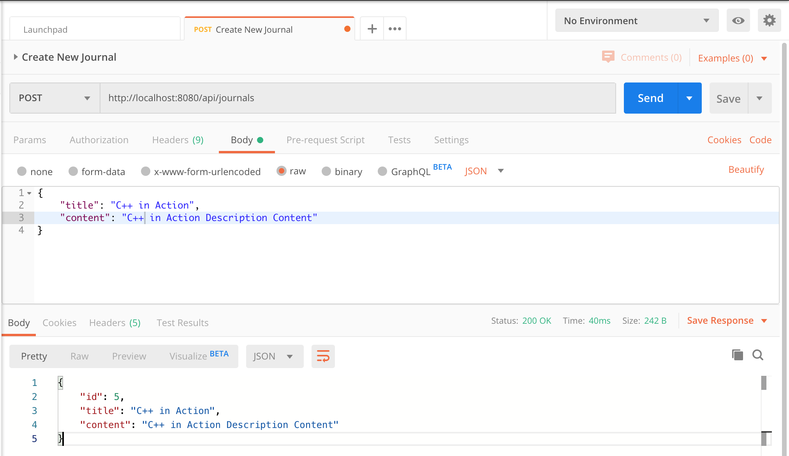
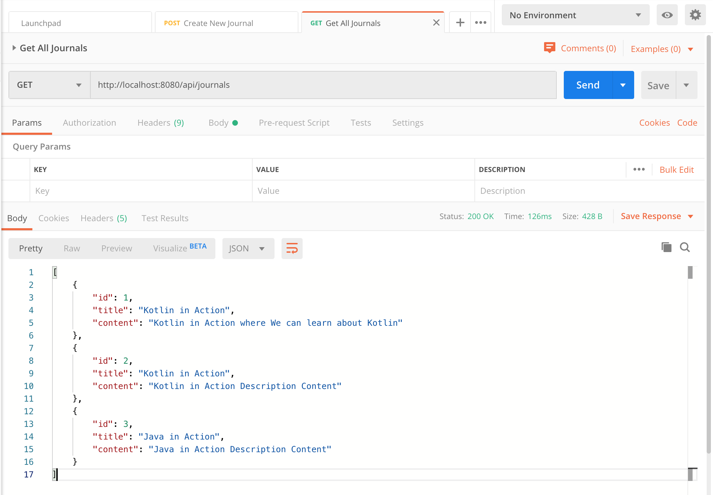
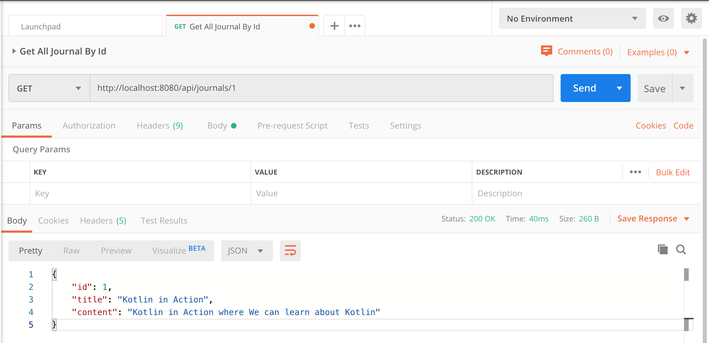
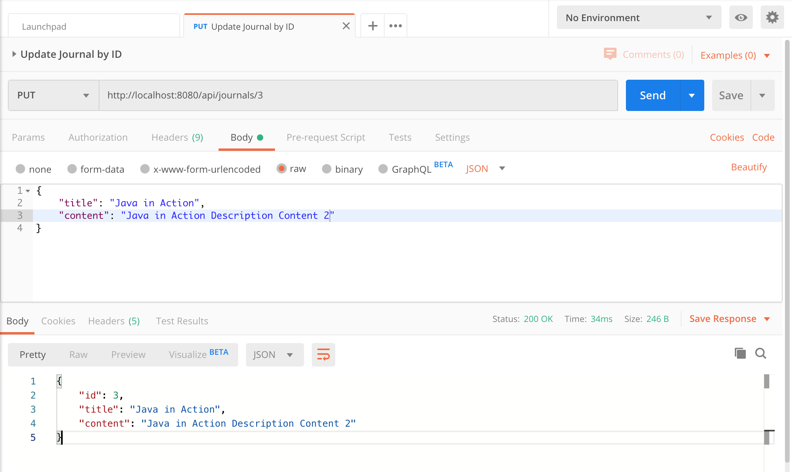
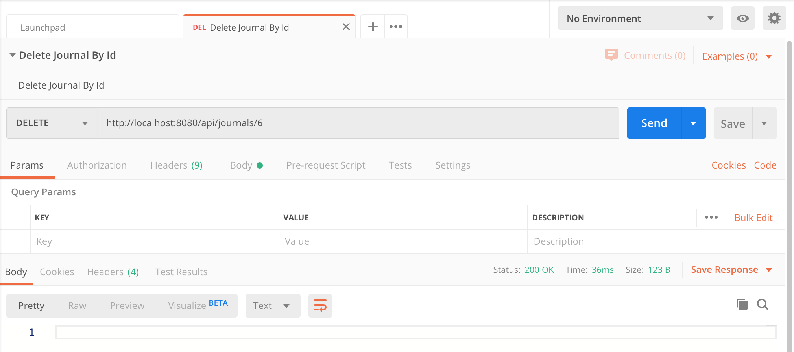

# springboot-kotlin-journal-app-demo

## Things to do list:
1. Clone this repository: `git clone https://github.com/hendisantika/springboot-kotlin-journal-app-demo.git`
2. Go to your folder: `cd springboot-kotlin-journal-app-demo`
3. Run the application: `gradle clean BootRun`
4. Open your POSTMAN or Insomnia application.

## Screen shot

**Add New Journal**

**Get All Journals**

**Get Journal by ID**

**Update Journal by ID**

**Delete Journal by ID**

If You want to test REST API directly You can import the POSTMAN collection here.